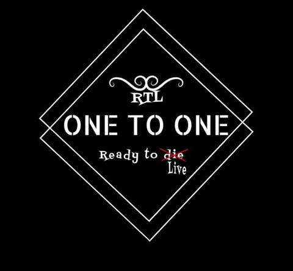

#  La Daily Scrum Meeting es una reunión (evento) de Scrum de corta duración, unos 15 minutos, 
que debería ocurrir todos los días del Sprint y siempre a la misma hora.
 El objetivo buscado a través de las reuniones diarias es promover la comunicación y 
 la transparencia dentro del equipo.-

 # ¿Qué se hace en un Daily?

# Qué se hace en un Daily meeting? – Stratos Agein.
Es un encuentro entre los miembros del equipo en el que cada uno 
inspecciona el trabajo que el resto realiza: dependencias entre tareas,
progreso hacia el objetivo del Sprint y obstáculos que pueden impedir este objetivo.

# ¿Qué es una reunión Daily?

El daily en scrum es una reunión de 15 minutos de duración,
del equipo de desarrollo scrum, en el que se sincronizan las actividades que están ocurriendo en el sprint,
y la planificación de las actividades de las próximas 24 horas.33

---- SE CONOCIERON NUEVAS HERRAMIENTAS------

JIRA( Pagina de Herramientas de gestión ágil de proyectos para equipos)
FIGMA. (PAGINA DE DISEÑO).

 ---MEDIOS DE COMUNICACION ----

 ZOOM.
 WASP.
# -----------------------------------------.

- # Primera reunion de nuestro proyecto_#

# SE REALIZO EN UNA SALA ORGANIZADA EN LA CLASES A CADA INTEGRANTE SE LE PRESENTO EN LA SALA DE REUNION.

- # SALA 2 # 

 -- INGRESARON A ELLA ---

 # INTEGRANTES:

- Nahuel Mendez.
- Julian Saucedo.
- Nicole Colmenarez.
- Ian Salinas.
 -Gisele Ortiz.

 # TEMA DE LA 1ER REUNION.

En esta misma reunion se determino que canal de reuniones y vamos usar.
- se elijio ZOOM.
## https://us05web.zoom.us/j/87576074667?pwd=b9SL4pk8O1XnYhjk8vqYBS4o35Rp4f.1

ID de reunión: 875 7607 4667
Código de acceso: 123
# ---------------------- #

El horario de la reunion.

 ..19 hs  cada vez que seamos convocados, 
 Por los integrantes, se ponen de acuerdo
el dia  asi se realizaria la reunion...

 # Asistencia..
En la primera reunion se armo un grupo de wasap..
-EN ESTE MISMO SE INGRESARON AL ERIC  Y  NAH PARA MEJORAR NUESTRO DESENPEÑO.
 
# ESTA REUNION DURO: 10:30 A 11 HS hasta que se termino  la clases.

# -------------------------------------------------------------- .

# SEGUNDA REUNION:

# tema del dia que vamos hacer! 
# Elejimos el proyecto.

 - SE CONOCIERON LOS INTEGRANTES--
 --SE DETERMINO QUE TIPO DE PROYECTO QUE  SE Y VA A REALIZAR--

-ENTRE TODOS HICIMOS UNA PROPUESTA Y LA GANADORA 
FUE LA PROPUESTA DE TIENDA ERA ROPA URBANA...
SE DERTERMINO QUE CADA UNO TENIA QUE PROPONER EL LOGO DE LA MARCA Y LA MARCA.

# ---------------- #
EN LA VOTACION SALIO TIENDA DE ROPA  URBANA 
-SE VOTO EL NOMBRE.( ONE TO ONE ).
ENTRE TODOS TUVIMOS DE ACUERDO DE SUBIR LA IMAGEN DEL LOGO DE LA MARCA..

# (REUNION DURO 20 MINUTOS.)
.

# TAREAS POR HACER #

-EN EL GRUPO DE WASS .... SE VOTO LA IMAGEN DEL LOGO TODOS SUBIERON SU PROPUESTA..
GANADOR DEL DIA (NAHUEL MENDEZ)...

# -----------------------------------------------------------------------.

# REUNION NUMERO 3----

# CONOCIENDO HERRAMIENTAS..
# ESTA REUNION DURO 20 MINUTOS..

-- SE PRESENTO UNA PAGINA LLAMADA FIGMA..
-- BUSCANDO  STYLES.
-- CONOCIMOS PAGINAS NUEVAS PARA DISEÑO.

# TAREAS POR HACER#
.....CADA UNO DEL EQUIPO TENIA QUE ELEJIR QUE TIPO DE PAGINAS Y VAMOS  A TENER EN CUENTA PARA DISEÑO...
....CADA UNO LO MANDO POR EL Wasap y ahi se vieron las paginas como referencia...

# -----------------------------------------------------------------------.

# REUNION NUMERO 4---

# TRABAJANDO EN FIGMA..

-- Y SE ELIJIO EL COLOR DE LA PAGINA.. 
--- SE ELIJIO LOS ICONOS...
--- BUSCAMOS ENTRES TODOS ...

# TAREA POR HACER.

----CADA DEBIA REALIZAR UN DISEÑO BASADO A LA IMAGEN DE LAS PAGINAS REFERENTES.

# --------------------------------------------------------------------------.

# REUNION NUMERO 5.

# MOSTRAR NUESTROS DISEÑOS.

----NOS REUNIMOS PARA MOSTRAR NUESTROS DISEÑOS.
Y HABLAR DE LOS CAMBIOS Y MEJORA.

# TAREA POR HACER..

CORREGIR LOS DISEÑOS PARA QUE SE VEA QUE ES DE LA MISMA PAGINA

# -------------------------------------------------------------------------.

# REUNION NUMERO 6.

# REVISION FINAL Y ENTREGA DEL DISEÑO.

ENTRE TODOS NOS PUSIMOS DE ACUERDO QUE NAHUEL MENDEZ Y VA A ENTREGAR EL DISEÑOS..

# ----------------------------------------------------------.
